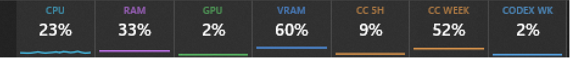
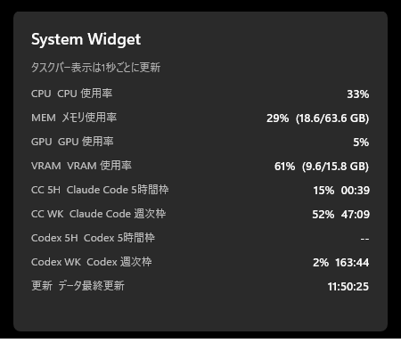

# System Widget for WidBar

> **About this fork**: This is a fork of [10tonchan/claude-codex-widbar](https://github.com/10tonchan/claude-codex-widbar). It differs from the original in that:
>
> - Codex support has been removed.
> - Each stat can be shown or hidden from the widget's settings. By default only the two Claude Code tiles are shown, so the widget fits in narrower taskbar gaps.
> - The taskbar strip sits on a rounded card.
> - The Claude Code lines span the whole 5-hour or weekly window, and the flyout adds a chart for each window with a projection of usage at reset.
> - The code and UI are in English only.

A [WidBar](https://github.com/andelby/widbar) widget for the Windows taskbar that shows local CPU, RAM, GPU, VRAM, and Claude Code usage.

This directory is meant to publish **source code only**. No MSIX binaries, certificates, credentials, or usage logs are included.

> **Disclaimer**: This is an independent, community-built project. It is **not** created, endorsed, or officially supported by Anthropic. "Claude" and "Anthropic" are trademarks of Anthropic, PBC.
>
> This project reads Claude Code usage data via `https://api.anthropic.com/api/oauth/usage`, the same undocumented OAuth endpoint the Claude Code CLI itself calls to power its `/usage` command. It is not part of Anthropic's public API and Anthropic may change or remove it without notice, which could break this feature at any time. The implementation is based on [sr-kai/claudeusagewin](https://github.com/sr-kai/claudeusagewin) (MIT license) — see [THIRD-PARTY-NOTICES.md](THIRD-PARTY-NOTICES.md).

## Screenshots

The taskbar tile strip:



Clicking it opens a flyout with the same figures plus remaining time until each limit resets:



## What it shows, and where the data comes from

All measurement happens on your PC. The widget itself never sends data anywhere.

| Item | Source | Notes |
| --- | --- | --- |
| CPU / RAM | Windows system APIs | Refreshed every second |
| GPU / VRAM | Windows PDH / DXGI | Requires a supported driver |
| Claude Code | The same undocumented API the Claude Code CLI uses (`/api/oauth/usage`) | Fetched with the OAuth token in `~/.claude/.credentials.json`. Same figures as the "plan usage limits" screen on claude.ai |

If Claude Code credentials can't be read, the widget shows `--`.

## Choosing which stats to show

By default only the two Claude Code tiles are shown, to keep the widget narrow enough to fit most taskbar gaps. Open the widget's settings (the gear in the flyout, or *Configure* in WidBar) to toggle each stat on or off. Hidden stats are removed from both the taskbar strip and the flyout, and the taskbar strip shrinks to fit. At least one stat must stay visible. Hiding both GPU stats stops the GPU performance counters being read, and hiding both Claude Code stats stops the usage API being called.

## Claude Code usage over time

The Claude Code tiles' lines span the whole limit window (5 hours or 7 days): the line fills in from the left as the window passes, so a line that's high and short means you're using it up quickly. The flyout shows a larger chart for each window with a marker for now, a dashed line at 100%, and a projection of where you'll be at reset if you keep the same pace (or roughly when you'll hit the limit).

The usage API only reports the current figure, so the widget builds this history itself from each fetch (about every 3 minutes) and saves it in its WidBar data folder. History before the widget was running isn't available; the line is drawn straight from 0% at the window's start to the first recorded point.

## Requirements

- Windows 11 (x64 or ARM64)
- [WidBar](https://github.com/andelby/widbar)
- Visual Studio 2022 (Desktop development with .NET, Windows App SDK and Windows SDK)
- .NET 8 SDK

## Build and register locally

1. Get this directory and open `SystemWidget.WidBar.sln` in Visual Studio 2022.
2. Select `Debug | x64` and build `SystemWidget.WidBar (Package)`.
3. Register the development loose layout. An elevated PowerShell isn't required, but Windows Developer Mode may need to be enabled.

```powershell
Add-AppxPackage -Register ".\SystemWidget.WidBar (Package)\bin\x64\Debug\AppxManifest.xml"
```

4. Launch WidBar and add **System Widget** to the taskbar from the catalog.

Deploying from Visual Studio, or distributing the MSIX locally, requires a signature Windows trusts. Just publishing the source on GitHub needs neither signing nor a Microsoft Store listing. See Microsoft's [MSIX signing guide](https://learn.microsoft.com/windows/msix/package/create-certificate-package-signing) for how to handle a development self-signed certificate.

## Verifying changes during development

After building the package project, restart WidBar and check the values on screen. `Rebuild` while the widget is running will fail because the output files are locked — in that case, quit WidBar first, build, then relaunch it. When fixing GPU/VRAM or usage figures, cross-check the widget's displayed value against the raw local reading at the same point in time.

```powershell
& "C:\Program Files\Microsoft Visual Studio\2022\Community\Msbuild\Current\Bin\amd64\MSBuild.exe" `
  "SystemWidget.WidBar (Package)\SystemWidget.WidBar (Package).wapproj" `
  /p:Configuration=Debug /p:Platform=x64 /restore
```

If the tiles still show stale values after a rebuild, don't trust a "Build succeeded" message alone — MSBuild's incremental build has been observed to skip recompiling the extension project and repackage stale binaries. Force a clean rebuild (delete `bin`/`obj`, or pass `/t:Rebuild`) and reconfirm.

The package project syncs the `plugin.json` generated by the WidBar SDK into the package's `Public/` folder on every build. If you need to change the ID or display name, don't hand-edit that generated `plugin.json` — change the `WidBarPlugin*` properties in `SystemWidget.WidBar.ExtensionApp.csproj` instead.

## Privacy and security

- `~/.claude/.credentials.json` is read-only. Nothing is ever written back to Claude Code's own files.
- The OAuth access token is refreshed only when it has expired, using the refresh token; the result is cached solely in `%LOCALAPPDATA%\system_widget\claude_token.json` (a cache local to this widget). Nothing is sent anywhere else.
- Claude Code credentials are accessed read-only.
- MSIX packages, certificates, `bin/`, and `obj/` produced by local builds are excluded from Git.

## License

This source is licensed under [GPL-3.0-only](LICENSE). See [THIRD-PARTY-NOTICES.md](THIRD-PARTY-NOTICES.md) for the licenses of directly-depended NuGet packages.

## Current distribution policy

This release targets publishing source on GitHub. Signed MSIX distribution, a Microsoft Store listing, and a commercial code-signing certificate are all out of scope for now.
